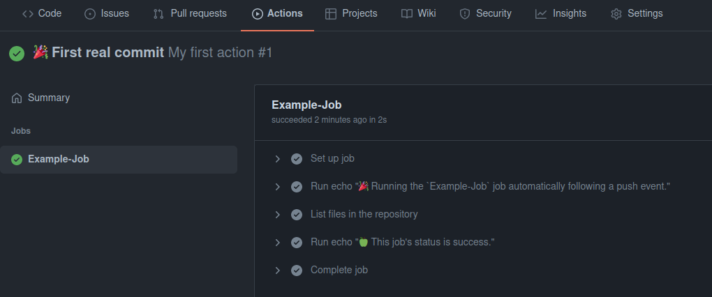
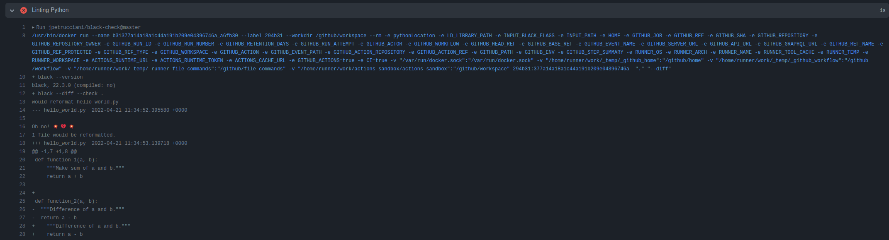
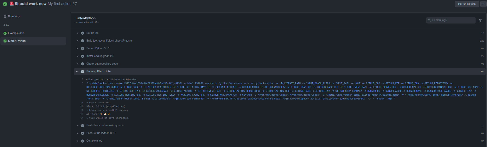
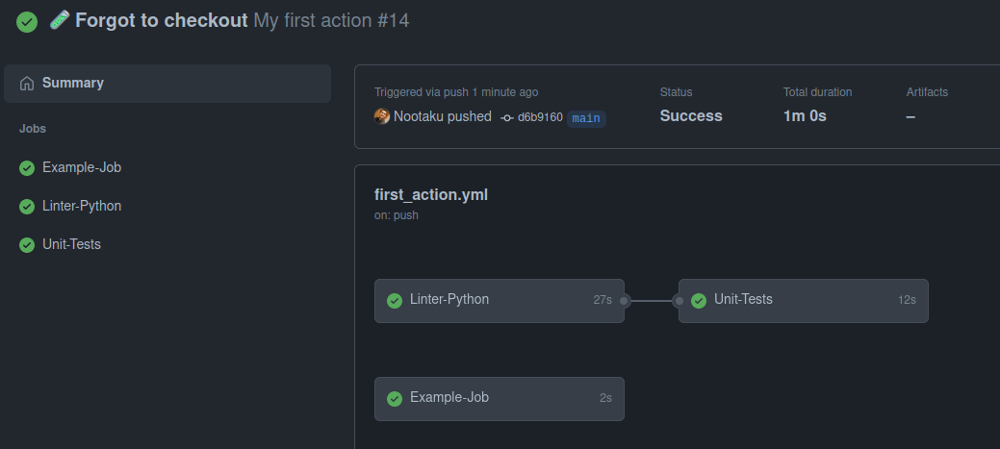
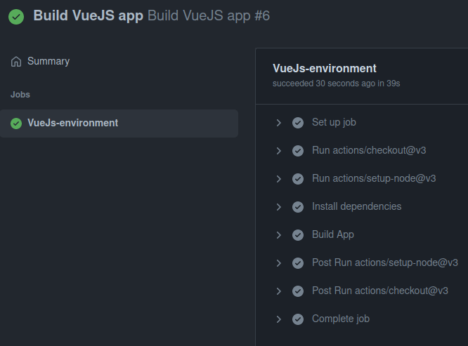

# Actions Sandbox

This repo has the purpose of learning the GitHub Actions tool to create CI/CD pipelines. I'll be tinkering with a few concepts and you're welcome to follow along.

In this sandbox, I want to achieve the following objectives:

1. Create a simple `python` script and lint it.
2. Create a unit test with `pytest` and validate that the tests pass.
3. Create a simple `VueJS` webpage and build it.
4. From the previously builded SPA, I want to make a Docker image and push it to `ghcr.io`
5. Fuze everything together to create multiple images (one python API, one VueJS client) and push them to `ghcr.io`

Let's go !

## Getting started

First of, you can find all the documentation [here](https://docs.github.com/en/actions).

### Creating our first action

#### Step 1 - Creating the files

Github Actions use the `yaml` syntax to run. The actions files should be created in `.github/workflows` directory. So, our first step is to make that directory.

```bash
# Actions directory
mkdir .github
cd .github
mkdir workflows
cd workflows
touch first_action.yml
```

#### Step 2 - Writing the GitHub Action

```yaml
name: My first action

on: [push]
jobs:
  Example-Job:
    # The action should run on Ubuntu 20.04
    runs-on: ubuntu-latest

    # Indicate what should happen.
    steps:
      - run: echo "🎉 Running the `Example-Job` job automatically following a ${{ github.event_name }} event."
      - name: List files in the repository
        run: ls ${{ github.workspace }}

      - run: echo "🍏 This job's status is ${{ job.status }}."
```

> Each Action file has
>
> A `name`<br/>
> A `on` event statement that defines when the action should be triggered <br/> `jobs` that indicate what should happen
>
> Each job has the `run-on` statement that indicates which runner (os) should be used and a collection of `steps` that represent the workflow of a job.
>
> Each step either directly uses a command using the `run` keyword or first give it a `name`.

##### Commit as is and see the result

Once committed we can go to our Repo and click on **_Actions_** then click on the `Example-Job` from the list. We should see this:



Cool !

## Lint a simple python file

### Step 1 - Write the python

Now, let's write our python code in a new document located at `./hello_world.py`

```bash
# Python file we will use
touch hello_world.py
```

```python
def function_1(a, b):
    """Make sum of a and b."""
    return a + b

def function_2(a, b):
  """Difference of a and b."""
  return a - b
```

In this example I made 2 linter mistakes:

1. There should be 2 lines between `function_1` and `function_2`
2. I used tabs for the spacing of `function_1` and spaces for `function_2`

### Step 2 - Modifying our Action

If we go to the [GitHub Actions Marketplace](https://github.com/marketplace?type=actions) we can find already existing actions created by official entities (Docker, Python, NodeJs, ...) or other users.

In this case we want to linter our python code. I chose to go for Black.

```yaml
Linter-Python:
  runs-on: ubuntu-latest
  steps:
    - name: Check out repository code
      uses: actions/checkout@v3
    - name: Running Black Linter
      uses: jpetrucciani/black-check@master
      with:
        black_flags: "--diff"
```

Notice the `uses` keyword that allows to use existing actions.

#### Note

At first I thought that the code as is would work. However, I quickly noticed that it wouldn't.

Our server has no idea what version of python it should use or how to install dependencies if required.

So let's make that happen first:

```yaml
Linter-Python:
  runs-on: ubuntu-latest
  - name: Set up Python 3.10
    uses: actions/setup-python@v2
    with:
      python-version: "3.10"

  - name: Install and upgrade PIP
    run: python -m pip install --upgrade pip
```

### Step 3 - Commit and check

When we run this version, we can see the following:



We can now refer to the [black documentation](https://black.readthedocs.io/en/stable/usage_and_configuration/the_basics.html)

We can see that we have a linter error and where this error is located.

Let's correct it and run the action again.



And indeed, it passes.

## Passing Unit Tests

We managed to create a Linter tester. Great !

Now we want to create a few `pytest` unit-tests and ensure that all tests are passing. For this Job we will not use any existing Action but will make our own. Moreover, we are going to ensure that the Job will only run **if the Linter Job is successful**.

### Step 1 - Writing the tests

Pytests are stored in a directory called `tests`. So let's do that:

```bash
mkdir tests
cd tests
touch test_hello_world.py
```

```python
import pytest
import hello_world as logic


@pytest.mark.parametrize('a, b, expected', [
  (1, 2, 3),
  (5, 5, 10),
  (3, 'foo', TypeError())
])
def test_function_1(a, b, expected):
    if isinstance(expected, Exception):
        with pytest.raises(type(expected)):
            logic.function_1(a, b)
    else:
        assert logic.function_1(a, b) == expected
```

also create a `setup.py` file at the root of the project to follow the [pytest good practices](https://docs.pytest.org/en/6.2.x/goodpractices.html)

### Step 2 - Add a Unit Test Job

```yaml
Unit-Tests:
  runs-on: ubuntu-latest
  needs: Linter-Python

  steps:
    - name: Set up Python 3.10
      uses: actions/setup-python@v2
      with:
        python-version: "3.10"
    - name: Install and upgrade PIP
      run: python -m pip install --upgrade pip
    - name: Check out repository code
      uses: actions/checkout@v3
    - name: Install dependencies
      run: |
        pip install pytest
        pip install -e .
    - name: Run Unit Tests
      run: pytest
```

Note the `needs` keyword. This can be a string or a list. And allows to only run a job if the given _needed_ job succeeds.

This job has also taught me the importance of the checkout action (`actions/checkout@v3`) that allows the job to get access to the pushed code. In my case my pipeline failed multiple times not finding the `setup.py` file I had created.

#### Here is the result



Note how the summary visuals have changed. There is now a clear link between the Linger and the Unit tests.

## Simple VueJS Single Page Application

Let's create a new VueJS project:

```bash
vue create simple-sap
```

In the options choose the default Vue3 options. This should create a default project that already works (we can connect to the page).

### Create the Action

Let's create a new action for this. I call it `vue_js.yml`

What I want to do is to create a new dependency between actions. I want my `vue_js.yml` action to run ONLY if the `first_action.yml` has been successful. According to the [documentation](https://docs.github.com/en/actions/using-workflows/events-that-trigger-workflows) we can create an event that will trigger an action. This event can be the completion of another action.

```yaml
name: Build VueJS app

on:
  workflow_run:
    workflows: ["My first action"]
    types:
      - completed

jobs:
  VueJs-environment:
    runs-on: ubuntu-latest
    steps:
      - uses: actions/checkout@v3
      - uses: actions/setup-node@v3
        with:
          node-version: "16"
      - run: cd simple-sap && npm install
      - run: cd simple-sap && npm run build
```

The result is a nice passing pipeline. --> 

#### Notes:

I've noticed 2 things during this process:

1. Each step of the pipeline resets the working directory (for the `run` commands) to the root of the repo. This is why we had to write `run: cd simple-sap && npm install` and `run: cd simple-sap && npm run build` as one-liners. We could have also used the following multiline syntax:

```yaml
- run: |
    cd simple-sap
    npm install
    npm run build
```

2. After looking at [the documentation](https://docs.github.com/en/actions/using-workflows/workflow-syntax-for-github-actions#jobsjob_idstepsrun) it appears we can define the working directory for each command using the `working-directory` instruction. So let's try it out and change the our `Build VueJS app` _yaml_ file.

```yaml
name: Build VueJS app

on:
  workflow_run:
    workflows: ["My first action"]
    types:
      - completed

jobs:
  VueJs-environment:
    runs-on: ubuntu-latest
    steps:
      - uses: actions/checkout@v3
      - uses: actions/setup-node@v3
        with:
          node-version: "16"

      # Also added names to the steps for clarity
      - name: Install dependencies
        run: npm install
        working-directory: ./simple-sap
      - name: Build App
        run: npm run build
        working-directory: ./simple-sap
```

> Seems like it is working:
>
> 

## Create a Docker image from the VueJS single page Application

Again [the documentation](https://docs.github.com/en/actions/publishing-packages/about-packaging-with-github-actions) is pretty extensive about this part.

The problem that I have been facing is the "non-existence" of the `./dist` directory in the repo and outside of the pipeline.

But first things first ... the `Dockerfile`:

### Step 1 - The Dockerfile

```Dockerfile
# Base image
FROM nginx:stable-alpine

# Create new group and user (with UID = 1000)
ARG USERNAME=www-data
ARG UID=1000

# set -eux; will stop the script if any error occurs
RUN set eux; \
    adduser -S -D -u ${UID} -G ${USERNAME} ${USERNAME}; \
    chown -hR ${USERNAME}:${USERNAME} /usr/share/nginx; \
    chown -hR ${USERNAME}:${USERNAME} /var/cache/nginx; \
    touch /var/run/nginx.pid; \
    chown -hR ${USERNAME}:${USERNAME} /var/run/nginx.pid

# Set working directory to nginx resources directory and remove default resources
WORKDIR /usr/share/nginx/html

# Copy the builded app to the image
COPY ./dist .

USER www-data
```
